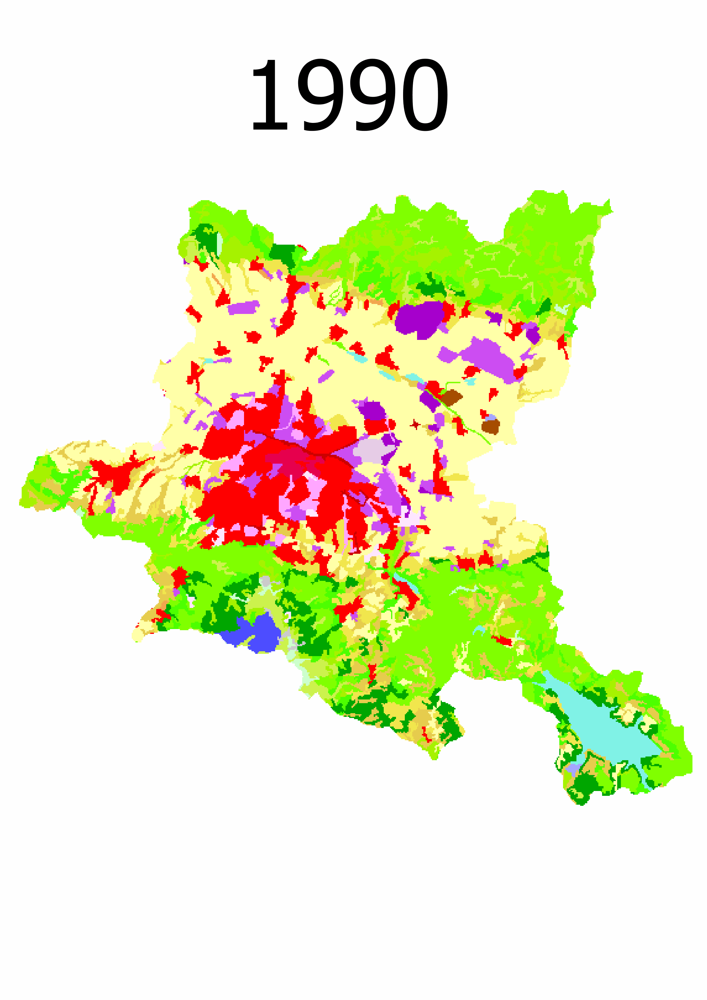

# lst-prediction
LST prediction based on remote-sensing and socio-economic factors 

## Initialization & Setting 

* Install dependencies 

```sh 
pip install -r requirements.txt
```

* Make sure you have **jupyter notebook** in some shape or form 

## Retrieval of Remote Sensing Imagery 
The data used is **selected** with a Google Earth Engine **JS** script which can be found [here](./data-collection/find-images.js). The imagery of choice is from different time periods, which contributes to the overall variability.    

It should be noted that only images with cloud coverage of less than 10% have been picked, which is efficiently carried out on the Google Earth Engine Server. 

Landsat Collection 2 served as the main source of data for this experiment. The choice of this image collection product was based on the following factors: 
* Atmospheric correction has already been performed 
* It is well documented 
* Includes a Surface Temperature product 
* Wide temporal availability - imagery has been preprocessed for the Landsat 4/5/7/8/9 satellite generations
* High resolution - least precision is 120m pixel size
* Accessible for free from USGS Earth Explorer or Google Earth Engine


Spatially, **the area of interest** is **Sofia City** Municipality. A geotif of the boundaries can be found [here](./shapefiles/sofia-boundaries.json).   

[Further retrieval](./lst-and-indices-retrieval.ipynb) is perfomed using the Google Earth Engine **Python API** in the following manner: 
*  Landsat Collection 2 is used to extract Land Surface Temperature and Spectral indices for each selected image
    * Satellites used are Landsat 5, 7, 8
* [The Global Human Settlement Layer Population dataset](https://human-settlement.emergency.copernicus.eu/ghs_pop2023.php) is utilized for the extraction of population count per pixel as a socioeconomic factor affecting Land Surface Temperature.  

All imagery has been resampled to the least precise resolution of *120m*. 

Data can be explored in the [population notebook](population-eda.ipynb) and the [remote sensing demo notebook](demo.ipynb). 


### [Pythonic Workflow](lst-and-indices-retrieval.ipynb) 

1. Collection and preprocessing
*   ```eemont``` module
    * To perform the respective cloud masking and scaling of satellite imagery 
    * To extract spectral indices in an automatic way 

2. Data handling
* ```rasterio``` for raster data handing 
    * clipping and visualization 
    * conversion to numpy arrays for dataset formation
* ```geopandas``` for vector data handling 
* ```raster_stasts``` to  derive zonal statistics for Sofia Municipality  

3. Machine Learning Experiment 

* ```sklearn``` for model training and validation 


### Limitations 
* The data does not incorporate Land-use-land-cover distribution, although it is an essential factor, if not the most essential when it comes to the UHI effect. However, the spectral indices serve as a proxy. Moreover, since they are calculated from the bands of images, temporal changes are readily reflected in this computation. 
    * Although Google Earth engine provides the CORINE dataset, which would've greatly contributed for the ease of integration, we found an inconsistency. The problematic region is easily observable:   
    
  


Hence the question of the overall correctess of the Land-use-land-cover datasets remains open. 

Urban Atlas, on the other hand, which is indeed more consistent and precise(by virtue of it being a vector dataset), is temporally limited. Even more so, is not available through the GEE API and thus its integration would be quite arduous. 

* The satellite imagery collected is temporally limited - all Landsat photos of the area are taken at around 9:00 Greenwich Mean Time(GMT). 
    * During Daylight Saving time, Bulgaria shifts to GMT+3 hence the time of taking the imagery is 12 at noon Local Standard Time 
    * Otherwise, GMT+2 -- 11 AM 

    Unfortunatelly, the UHI effect is weakest at around noon, especially in the summer. This limitation of remote sensing data acts as a hindrance in the analysis of the SUHI(Surface Urban Heat Island) effect. 

* Other factors which contribute to the LST such as Elevation, Albedo and other socioeconomic factors(e.g. social status, mean family income, etc.) have not been taken into account due to lack of data availability 

* More advanced Machine learning algorithms are yet to be explored in terms of their suitability for the regression problem.

